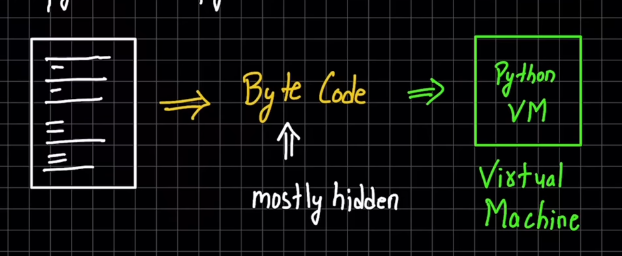

# Python Init

- created a python file 'say_hello.py' with a basic function : 
```python
def sayHello(name):
    print("Hello "+name)
```
- create a python file 'call_hello.py' which imports the sayHello() function from the previous file. 
```python
from say_hello import sayHello

sayHello("Soma Senpai")     # Hello Soma Senpai
``` 
- We could see that a new folder was created in the current dir: '__ pycache __'

---

## Inner Working (Behind the scenes of python)

- When we execute a python file using:
> python call_hello.py
- The python code is converted into **byte code** (mostly hidden, normally we wouldn't get the pycache folder unless we import a file)
- Along with the installation of python language, we also installed the **python virtual machine**.
- The converted **byte code** is run inside this python VM.
---
**Steps of running a Python script**

1. **Compile to byte code** 
   - This is done by the python compiler
   - doesn't mean it is a compiled language, here compile is technical jargon for saying it is converting the high level python code into `byte code`
   -  `byte code` is a low level code (not machine code) & platform independent (where ever there is a python VM, this byte code file can run)
   - `byte code` runs comparatively faster (because most of the checks and parsing has already been taken place) 
   - `.pyc` extension is for compiled python (aka frozen binaries)
   - `__ pycache __` folder holds all the .pyc files which are crated whenever we make new code or make changes to the code in our python scripts. The **double underscores** at the beginning and end of the word suggest that this keyword is mostly for the internal working of python. You'll encounter them more later. (Eg: __ main __)
   - For the updating of these `.pyc` files, internally python uses some form of diffing algo (Algorithm to find only the changes made in the file). The creation of these files is also dependent on the version of python you are using.
     - default python uses cpython followed by version number of your python installation.
     - these files only come when we import files (not for top level files) to optimize imports

> **NOTE:**
> - **byte code** is NOT machine code (machine code is direct instructions which you can give to your hardware (intel/apple processor chips)). In all languages byte code != machine code
> - **byte code** is a python specific interpretation (will not run in any other VM. Eg: JVM)
> - There are other variants of python:
>   - cpython (default)
>   - jython
>   - Stackless
>   - IronPython
>   - PyPy

2. **Python VM (PVM)**
    - it runs a continuous loop which executes the byte code
    - the PVM executes the code line by line **(Hence Python is called a interpreted Language...for the most part)**
    - It can take both `byte code` & `python scripts` directly
    - It is also called a **Run time Engine** 
    - AKA **python interpreter**