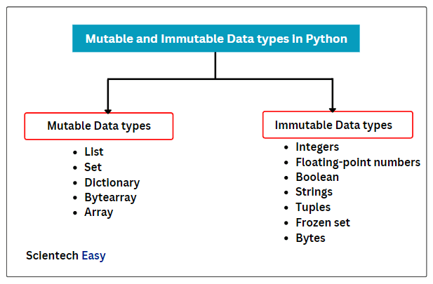
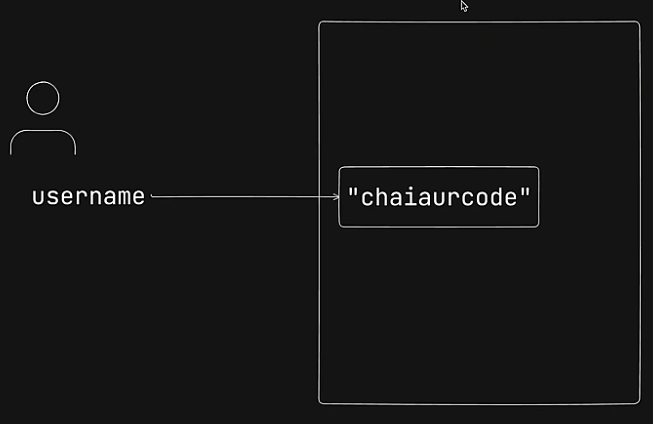
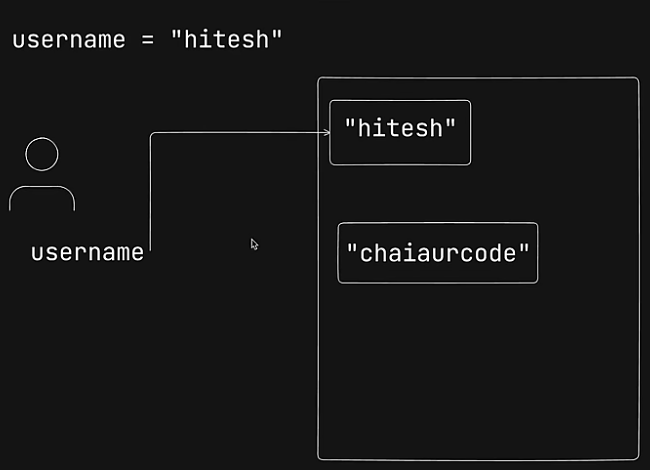

# Immutable and Mutable 
---
- When we search for mutable and immutable data types in python we can find something like this : 



- This can be confusing at first because me was like "But I can easily change integers and strings in python" cause 
  - Immutable = can't be changed
  - Mutable = can be changed
- However python works a little differently. Take the below example when we make a username = "hitesh"



- When the variable is made in python, it creates a object in memory which has a **immutable reference**. 
- When we make a change in the variable, the object in memory doesn't change. Python makes a another new object in memory with a **immutable reference** and makes the variable refer the new object.



- Python has it's own garbage collection so when it encounters such objects which none of the variables are referencing , it automatically removes them from memory.

> - This it the **TRUE** meaning of immutable. The variables reference can be changed but the object in memory can't be changed in case of Immutable data types.
> - When we are changing the value of a variable, we are actually just changing it's reference to a new object in memory.
---
---
1. This can also be seen in the below example as well:
```
>>> x = 10
>>> y = x
>>> x, y
(10, 10)
>>> x = 15
>>> x,y
(15, 10)
>>>
```
- We can see that the value of x is = 15 and y is = 10. Now we know why that is happening.
- First python makes a new object in memory and keeps the value 10 in it and gives the reference to x.
- Next y also gets the same reference to that object which has 10 in it.
- Next when we assign x the value 15, it creates a new object with the value 15 in memory and gives x the new reference, while y is still reference the old object in memory.
- Hence in the end, x = 15 and y = 10.

2. The Immutable nature of these objects in memory can be easily seen when using strings : 
```
>>> username = "Soma"
>>> username[0]
'S'
>>> username[0] = 'T'
Traceback (most recent call last):
  File "<stdin>", line 1, in <module>
TypeError: 'str' object does not support item assignment
```
- As predicted, we cannot change the immutable object in memory, only make a new reference to a new object.