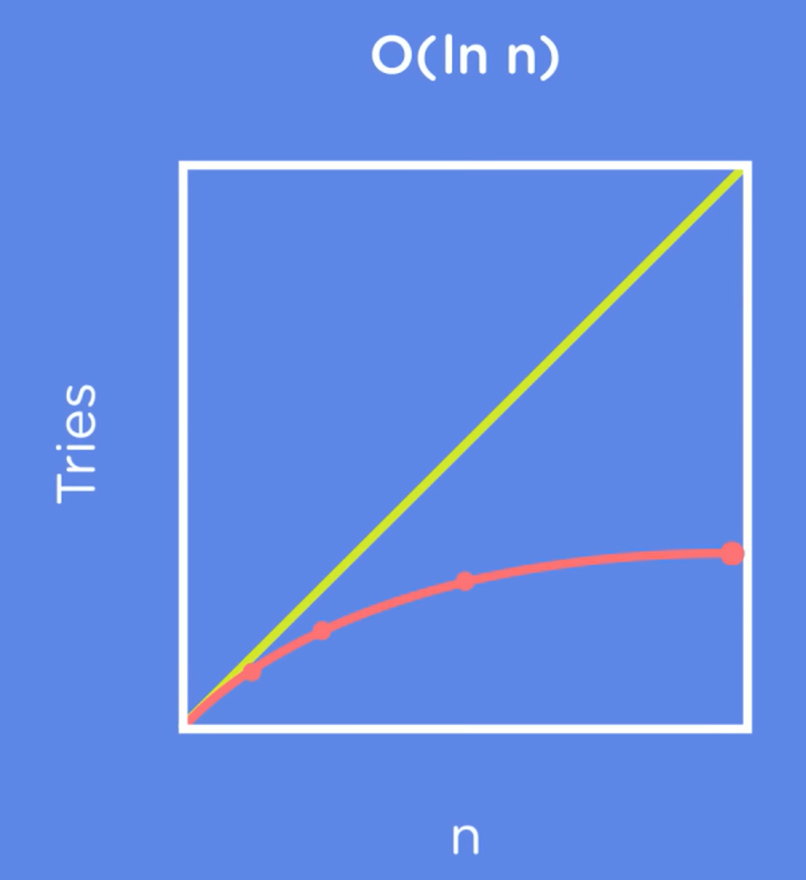
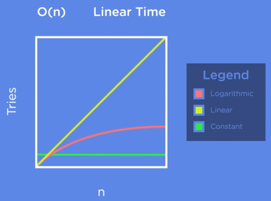
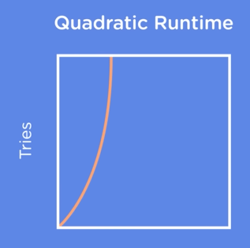
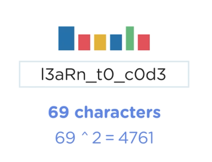
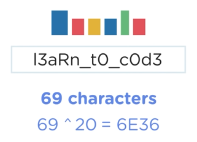
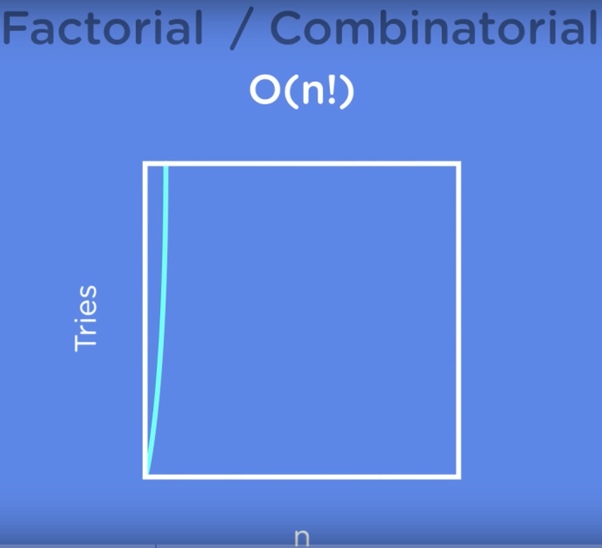

# Data Structures and Algorithms by FreeCodeCamp

---

## Complexity Analysis 
- As programmers, we will often ask 2 main questions : 
    1. How much **`TIME`** does this algorithm need to finish ? 
    2. How much **`SPACE`** does this algorithm need for this computation?


## Big O Notation

- `Big O` notation is used to describe the time complexity of an algorithm.
- `Big-O` give an upper bound of the complexity in the **worst case**, helping to quantify performance as the input size becomes arbitrarily large.

| Complexity           	| Big O Notation   	|
|----------------------	|------------------	|
| Constant Time        	| O(1)             	|
| Logarithmic Time     	| O(log(n))        	|
| Linear Time          	| O(n)             	|
| Linear arithmic Time 	| O(n log(n))      	|
| Quadratic Time       	| O(n<sup>2</sup>)  	|
| Cubic Time           	| O(n<sup>2</sup>) 	|
| Exponential Time     	| O(x<sup>n</sup>) 	|
| Factorial Time       	| O(n!)            	|

Logarithmic Time is also called sub-linear because it takes less time to calculate than linear time. (The graph line is lower than the linear line)





- We know that `binary search` is better than linear search so why don't we always use `Binary Search` ?
- This is because there was a additional step in the BS algorithm - **sorting the array**.
- `Sorting` algorithms have there own complexities just like search algorithms. Which adds to our original problem of searching.
- So for certain (smaller) values of n, linear search actually performs better than binary searching. 
- That's why picking the right algo for the problem is key.

<br>

### Quadratic and Quasilinear Run times 

- `Quadratic` run times are when we have to deal with each element of a 2D matrix or array. 
- Similarly for `cubic` run times we have to deal with each element of a 3D matrix or array.
- They look something like this on the graph:



- `Quasilinear` run time is denoted by `O(n log n)`
- `O(n log n)` means for every value of input we are going to execute log n operations, hence the run time is `O(n log n)`


- Quadratic and Quasilinear run times are most common.
- We will run into many such run times when we are doing Sorting algorithms 
- Eg: `Merge Sort` has a worse case scenario of `O(n log n)`
- This is because in merge sort we keep breaking the lists into smaller list b dividing in the middle. (`Log n` time operation) until there is only 1 element.
- When we merge the divided elements again, we do 1 comparison  operation per element to join the lists. (`n` time operation)
- So overall we get a `O(n log n)` worse case runtime.

<br>


- Till now we have been looking at Polynomial Runtime algo (whose O is in the form of O(n<sup>k</sup>)) 
- All the algorithms which fall under the quadratic or quasilinear run time line are considered efficient algorithms and will be used in practice. 

### Exponential & Factorial Run times Algorithms

- Exponential run times look something like : O(x<sup>n</sup>)
- This are far too computational expensive and are not considered efficient algorithms. 
- We mostly avoid using such algorithms in practice.
- Brute force algorithms for searching and sorting have exponential run times.
- Eg: Brute forcing a password to a website will take exponential time.: 

- With just 2 character we see that the number of operations will be 69<sup>2</sup> (69 is the number so characters allowed in passwords: english alphabets, numbers, special symbols, etc)
- Most websites have a password length of 20 characters which would take : 


<br>

- The next class of exponential algorithms is best highlighted by the Traveling salesman problem.
- **Problem Statement:** Given a list of cities and the distance between each city, which is the shortest route that visits every city exactly once and returns to the starting city?   
- The number of paths for 3 cities = 3! = 6
- The number of paths for 4 cities = 4! = 24
- This is called a factorial or combinatorial run time 


---

## ALgorithms in Code

### Linear Search 
```python 
def linear_search(list , target):
    for index,num in enumerate(list) :
        if num == target :
            return index
    return False

if __name__ == '__main__' : 
    list = [1,4,2,3,5,6,8,7,9.10]
    target = 12
    result = linear_search(list , target)
    if result : 
        print(f"{target} was found at index:{result}")
    else :
        print("The element was not found in the list")
```

### Binary Search 
```python 
def binary_search(list, target):
    first = 0
    last = len(list) - 1
    
    while first<=last :                 # remember that at the end of the search , we will have first = last 
        midpoint = (first+last)//2      # floor division 
        if list[midpoint] == target :
            return midpoint
        elif list[midpoint]<target : 
            first = midpoint + 1
        elif list[midpoint]>target :
            last = midpoint - 1
    return False

if __name__ == '__main__' : 
    list = [x+1 for x in range(21)]
    target = 5
    res = binary_search(list , target)
    if res : 
        print(f"{target} was found at index:{res}")
    else : 
        print('The element was not found in the list')
```

## Recursion & Space Complexity 

- a recursive function is a function which calls itself when executing 
- Binary search can be done recursively where the function calls itself with half a list of numbers and 
  
<br>

- Another way of defining the efficiency of a algorithm is by looking at it's **`space complexity`** 
- `Space Complexity` is the measure of how much additional storage will the algorithm require as teh size of input increases 
- The `space complexity` of the iterative Binary Search is `O(1)` (Constant time). 
- The `space complexity of the recursive Binary Search is `O(log n)` (Logarithmic time).