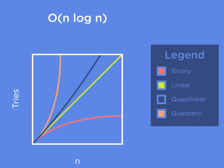
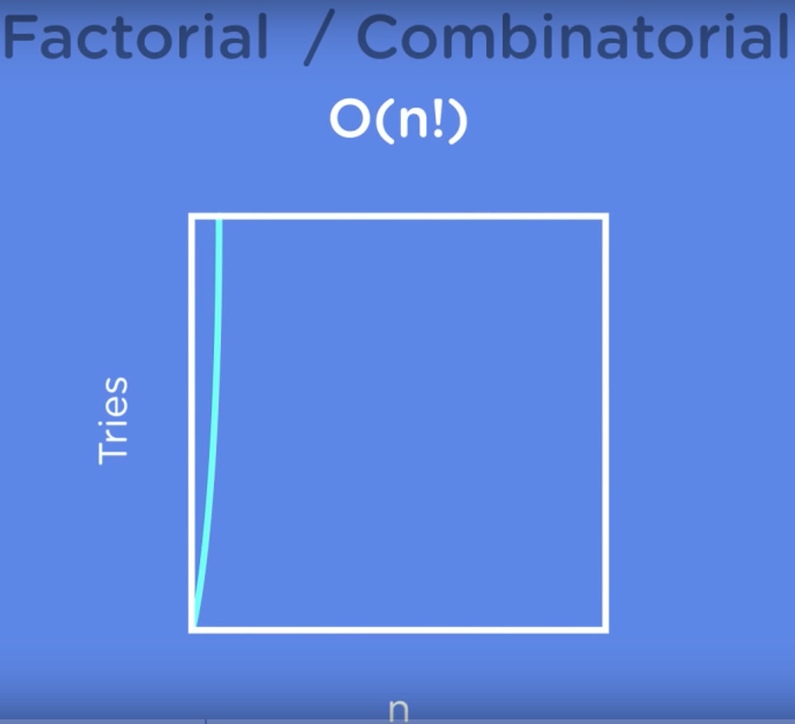

# Data Structures and Algorithms by FreeCodeCamp

---

## Big O Notation

- Big O notation is used to describe the time complexity of an algorithm.

1. O(n) - Linear Time
2. O(Log n) - Logarithmic Time
3. O(1) - Constant time 
4. O(n2) - Quadratic Time
5. O(n3) - Cubic Time

Logarithmic Time is also called sub-linear because it takes less time to calculate than linear time. (The graph line is lower than the linear line)

- We know that `binary search` is better than linear search so why don't we always use `Binary Search` ?
- This is because there was a additional step in the BS algorithm - **sorting the array**.
- `Sorting` algorithms have there own complexities just like search algorithms. Which adds to our original problem of searching.
- So for certain (smaller) values of n, linear search actually performs better than binary searching. 
- That's why picking the right algo for the problem is key.

 

### Quadratic and Quasilinear Run times 

- `Quadratic` run times are when we have to deal with each element of a 2D matrix or array. 
- Similarly for `cubic` run times we have to deal with each element of a 3D matrix or array.
- They look something like this on the graph:

- `Quasilinear` run time is denoted by `O(n log n)`
- `O(n log n)` means for every value of input we are going to execute log n operations, hence the run time is `O(n log n)`

- Quadratic and Quasilinear run times are most common.
- We will run into many such run times when we are doing Sorting algorithms 
- Eg: `Merge Sort` has a worse case scenario of `O(n log n)`
- This is because in merge sort we keep breaking the lists into smaller list b dividing in the middle. (`Log n` time operation) until there is only 1 element.
- When we merge the divided elements again, we do 1 comparison  operation per element to join the lists. (`n` time operation)
- So overall we get a `O(n log n)` worse case runtime.

 

- Till now we have been looking at Polynomial Runtime algo (whose O is in the form of O(nk)) 
- All the algorithms which fall under the quadratic or quasilinear run time line are considered efficient algorithms and will be used in practice. 

### Exponential & Factorial Run times Algorithms

- Exponential run times look something like : O(xn)
- This are far too computational expensive and are not considered efficient algorithms. 
- We mostly avoid using such algorithms in practice.
- Brute force algorithms for searching and sorting have exponential run times.
- Eg: Brute forcing a password to a website will take exponential time.: 

- With just 2 character we see that the number of operations will be 692 (69 is the number so characters allowed in passwords: english alphabets, numbers, special symbols, etc)
- Most websites have a password length of 20 characters which would take : 

 

- The next class of exponential algorithms is best highlighted by the Traveling salesman problem.
- **Problem Statement:** Given a list of cities and the distance between each city, which is the shortest route that visits every city exactly once and returns to the starting city?   
- The number of paths for 3 cities = 3! = 6
- The number of paths for 4 cities = 4! = 24
- This is called a factorial or combinatorial run time 

---

## ALgorithms in Code

### Linear Search 

