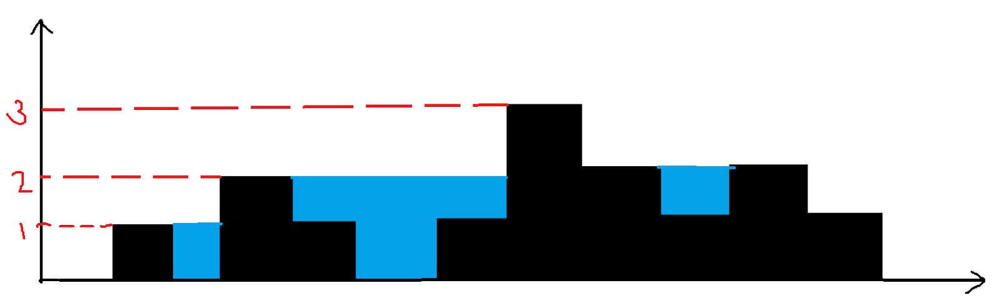

# Trapping Rainwater

**Problem Statement:** Given an array of non-negative integers representation elevation of ground. Your task is to find the water that can be trapped after rain.

**Examples:**
Input: height = [0,1,0,2,1,0,1,3,2,1,2,1]
Output: 6

Explanation: As seen from the diagram 1+1+2+1+1=6 unit of water can be trapped

Input:  [4,2,0,3,2,5]
Output: 9

<br>

## Brute Force Approach 

- [Watch it here](https://youtu.be/m18Hntz4go8?si=tppL97jOVZNGjQJH&t=164)
- Water trapped in between 2 elevation = **min(max_left_elevation, max_right_elevation) - current elevation**
- Or 
```
min(max_left[i], max_right[i]) - a[i]
```
- Loop from i to 0 for max_left 
- Loop from i to n-1 for max_right
- Do the above for each index

<br>

### Code 

```python 
from typing import List 

def trap(arr:List[int]):
    n = len(arr)
    total_water = 0 
    for i in range(n):
        left_max = arr[i]
        right_max = arr[i]

        j = i
        while j>=0:
            left_max = max(left_max,arr[j])
            j-=1
        # reset j
        j=i
        while j<n:
            right_max = max(right_max,arr[j])
            j+=1
        total_water += min(left_max, right_max) - arr[i]

    return total_water


if __name__ == "__main__":
    arr = [0, 1, 0, 2, 1, 0, 1, 3, 2, 1, 2, 1]
    print(f"The water that can be trapped is {trap(arr)}")
```
- **Time complexity : O(n<sup>2</sup>)**
- Space complexity : O(1)

<br>

## Better Approach

- We can boil down the complexity of by pre-computing the max_left and lax_right

### Algorithm 

- [Watch it here](https://youtu.be/m18Hntz4go8?si=Y7eQQ0DC85jTZwru&t=343)
- pre-compute the prefix_max array and suffix_max array
- Now traverse the array and calculate the total_water_trapped

<br>

### Code 

```python 
from typing import List 

def trap(arr:List[int]):
    n = len(arr)
    prefix = [0]*n
    suffix = [0]*n 

    prefix[0] = arr[0]
    for i in range(1,n):
        prefix[i] = max(prefix[i-1],arr[i])
    suffix[n-1] = arr[n-1]
    for i in range(n-2,-1,-1):
        suffix[i] = max(suffix[i+1],arr[i])
    trapped_rainwater = 0
    for i in range(n):
        trapped_rainwater+=min(prefix[i],suffix[i])-arr[i]
    return trapped_rainwater


if __name__ == "__main__":
    arr = [0, 1, 0, 2, 1, 0, 1, 3, 2, 1, 2, 1]
    print(f"The water that can be trapped is {trap(arr)}")
```

- **Time complexity : O(n)+O(n)+O(n) = O(3n)**
- **Space complexity : O(n)+O(n) = O(2n)**

<br>

## Optimal Approach 

- 2 Pointer approach

### Algorithm 

- [Watch it here](https://youtu.be/m18Hntz4go8?si=HPoi-whTBHgRj0gw&t=530)
- left pointer at arr[0], left_max = 0
- right pointer at arr[n-1], right_max = 0
- trapped_water = 0

### Code 

```python
from typing import List 

def trap(arr:List[int]):
    n = len(arr)
    left,right = 0,n-1
    left_max,right_max = arr[0],arr[n-1]
    trapped_rainwater = 0

    while left<=right:
        if arr[left]<=arr[right]:
            if left_max <= arr[left]:
                left_max = arr[left]
            else:
                trapped_rainwater += left_max - arr[left]
            left+=1
        else :
            if right_max <= arr[right]:
                right_max = arr[right]
            else:
                trapped_rainwater += right_max - arr[right]
            right-=1
    
    return trapped_rainwater


if __name__ == "__main__":
    arr = [0, 1, 0, 2, 1, 0, 1, 3, 2, 1, 2, 1]
    print(f"The water that can be trapped is {trap(arr)}")
```

- **Time complexity : O(n)**
- **Space complexity : O(1)**