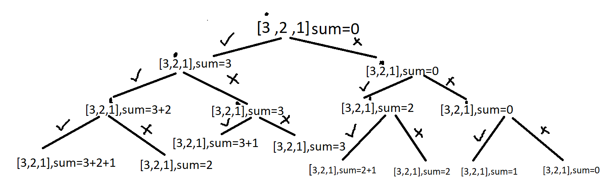

# Subset Sums (Recursive)

-  Given an array print all the sum of the subset generated from it, in the increasing order.

<br>

## Brute Force Solution 

### Algorithm 

- Generate all the subsets using Power Sets alogirhtm (uses bit manipulation)
- This algo with take **O(2<sup>n</sup> x n)** time to generate all the subsets.

<br>

- Using recursion, we can move a pointer i through the set.
- On each number, we can choose to either pick or not pick a number. 
- This way we will be generating all of the possible subsets 



- [Watch it here](https://youtu.be/rYkfBRtMJr8?si=LxBT3OJfEMq94MfZ&t=1062)

### Code 

```python 
from typing import List 

class Solution:
    def subsetSums(self,arr:List[int],n:int)->List[int]:
        answer = []

        def subsetSumHelper(index,sum):
            if index==n:
                answer.append(sum)
                return

            # The element is picked 
            subsetSumHelper(index+1,sum+arr[index])

            # The element is not picked
            subsetSumHelper(index+1,sum)
        
        subsetSumHelper(0,0)
        answer.sort()
        return answer

if __name__ == "__main__":
    arr = [3, 1, 2]
    ans = Solution().subsetSums(arr, len(arr))
    print("The sum of each subset is")
    for sum in ans:
        print(sum, end=" ")
    print()
```
- **Time complexity : O(2^n)+O(2^nlog(2^n))**
- **Space complexity : O(2<sup>n</sup>)**