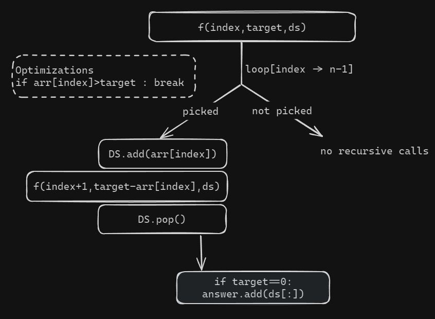

# Combination Sum - II : Unique combinations

Given a collection of candidate numbers (candidates) and a target number (target), find all unique combinations in candidates where the candidate numbers sum to target. Each number in candidates may only be used once in the combination.

**Note: The solution set must not contain duplicate combinations.**

<br>

```
Example 1:
Input: candidates = [10,1,2,7,6,1,5], target = 8
Output: 
[ [1,1,6],[1,2,5],[1,7],[2,6] ]
Explanation: These are the unique combinations whose sum is equal to target.
 
Example 2:
Input: candidates = [2,5,2,1,2], target = 5
Output: [[1,2,2],[5]]
Explanation: These are the unique combinations whose sum is equal to target.
```

<br>

## Brute Force Approach 

### Algorithm

- The same algo we used for `Combination Sum I`, all we change is that when we pick an element, we need to movge the index forward.
- Next we need to make the ds a hashset so that it only allows unique entries
- Convert the hashset back into a list at end.

### Code 

```python 
def combinationSum2(nums,target):
    n = len(nums)
    ds = []
    answer = set()

    def combinationSum2Helper(index,target):
        if index==n:
            if target==0:
                answer.add(tuple(ds[:]))
            return 
        if nums[index]<=target:
            ds.append(nums[index])
            combinationSum2Helper(index+1,target-nums[index])
            ds.pop()
        combinationSum2Helper(index+1,target)
    
    combinationSum2Helper(0,target)
    answer = [list(combo) for combo in answer]
    return answer

if __name__ == "__main__":
    v = [10, 1, 2, 7, 6, 1, 5]
    comb = combinationSum2(v, 8)
    print(comb)
```
- **Time complexity : O(2<sup>n</sup> * k * log(setSize))**
  - 2<sup>n</sup> for the total number of combinations 
  - k = avg length of subLists
  - log(setSize) to convert the set into the list
- **Space complexity : O(2<sup>n</sup>)**

<br>

## Optimal Approach 

- Modified version of pick-not-pick algorithm.



- If we do not pick, then we do no recursive calls.
- If we pick then we add it into the DS and see if the target reaches zero (base condition)


### Code 

```python 
def combinationSum2(nums,target):
    answer = []
    ds = []
    nums.sort()

    def combinationHelper(index,target):
        if target==0: 
            answer.append(ds[:])
            return 
        
        for i in range(index,len(nums)):
            if i>index and nums[i]==nums[i-1]:
                continue
            if nums[i]>target:
                break
            ds.append(nums[i])
            combinationHelper(i+1,target-nums[i])
            ds.pop()
    
    combinationHelper(0,target)
    return answer

if __name__ == "__main__":
    v = [10, 1, 2, 7, 6, 1, 5]
    comb = combinationSum2(v, 8)
    print(comb)
```
- Time complexity : O(2<sup>n</sup> * k) 
  - 2<sup>n</sup> sub sequences generated
  - k = avg length of all the subsequences
- Space complexity : O(k * x)
  - x = no. of unqiue combinations

<br>

---
---