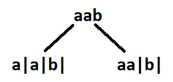
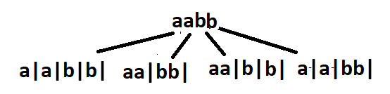

# Palindrome Partitioning 

You are given a string s, partition it in such a way that every substring is a palindrome. Return all such palindromic partitions of s.

Note: A palindrome string is a string that reads the same backward as forward.

```
Example 1:
Input: s = “aab”
Output: [ ["a","a","b"], ["aa","b"] ]	
Explanation: The first  answer is generated by  making three partitions. The second answer is generated by making two partitions.
```

```
Example 2:
Input: s = “aabb”
Output: [ [“a”,”a”,”b”,”b”], [“aa”,”bb”], [“a”,”a”,”bb”], [“aa”,”b”,”b”] ] 
Explanation: See Figure
```


<br>

## Brute Force Approach 

### Algorithm 

- [Watch it here](https://youtu.be/WBgsABoClE0?si=CIPLKLFhSlV-u65B&t=808)
- Check which which sections you can partition
- 

### Code

```python 
class Solution:

    def palindrome_partitions(self,string):
        ans = []
        part = []

        def dfs(i):
            if i==len(string):
                ans.append(part[:])
                return
            for j in range(i,len(string)):
                if isPalindrome(i,j,string):
                    part.append(string[i:j+1])
                    dfs(j+1)
                    part.pop()
        
        def isPalindrome(start,end,string):
            while start<=end:
                if string[start] != string[end]:
                    return False
                start+=1
                end-=1
            return True

        dfs(0)
        return ans

if __name__ == "__main__":
    s = "aabb"
    obj = Solution()
    ans = obj.palindrome_partitions(s)  
    print("The Palindromic partitions are :-")
    # [['a', 'a', 'b', 'b'], ['a', 'a', 'bb'], ['aa', 'b', 'b'], ['aa', 'bb']]
    print(ans)
```
- **Time complexity : O(2<sup>n</sup> * n/2 * k)**
  - O(2<sup>n</sup>) for generating all the combinations
  - O(n/2) for checking palindrome
  - O(k) for inserting the substring into ans DS, where k is avg length of substring
- **Space complexity : O(k*x)**
  - k is average length of palindrome substring
  - x is the number of such substrings

<br>

---
---