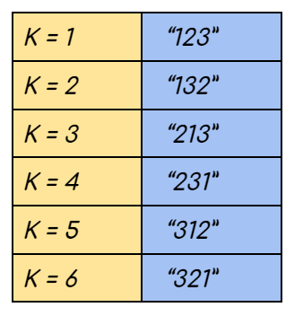

# K<sup>th</sup> Permutation Sequence 

- Given `N` and `K`, where `N` is the sequence of numbers from **1 to N([1,2,3..... N])** find the Kth permutation sequence.
- Example : For N = 3  the 3!  Permutation sequences in order would look like this:-



Note: 1<=K<=N! Hence for a given input its Kth permutation always exists

<br>

## Brute Force Approach : 

### Algorithm
- [Watch it here](https://youtu.be/wT7gcXLYoao?si=RWefQ7onj4h4Tobn&t=86)
- Recursively generate all the N! permutations.
- Return the kth value

### Code 

```python 
class Solution:
    def getPermutation(self,n:int,k:int)->int:
        numbers = [i for i in range(1,n+1)]
        answer = []

        # Recursive function to find all permutations (swapping approach)
        def fetchPermutations(index,numbers):
            if index == len(numbers):
                answer.append(numbers[:])
                return
            for i in range(index,len(numbers)):
                numbers[i],numbers[index] = numbers[index],numbers[i]
                fetchPermutations(index+1,numbers)
                numbers[i],numbers[index] = numbers[index],numbers[i]
        
        fetchPermutations(0,numbers)
        print(answer)
        return answer[k-1]


if __name__ == "__main__":
    n = 3
    k = 3
    ans = Solution().getPermutation(n, k)
    print("The Kth permutation sequence is", ans)
```
- **Time complexity : O(n! * n)**
  - n! for the recursion 
  - n for making the deep copy of the DS 
- **Space complexity : O(n)**

<br>

## Optimal Approach 

### Algorithm 

- [Watch it here](https://youtu.be/wT7gcXLYoao?si=Wu5XsB7LRd1cmuvT&t=237)


### Code 

```python 
class Solution:
    def getPermutation(self,n:int,k:int)->int:
        fact = 1 
        nums = []
        for i in range(1,n):
            nums.append(i)
            fact *= i
        nums.append(n)
        k-=1            # Cause we using 0 based indexing
        ans = ""
        while True:
            ans+=str(nums[k//fact])     # select the right digit
            nums.pop(k//fact)           # remove that digit from the list of available digits
            if not nums : break         # Stop if nums becomes empty 

            # update the k and fact
            k %= fact
            fact = fact//len(nums)
        return ans
    
if __name__ == "__main__":
    n = 4
    k = 17
    ans = Solution().getPermutation(n, k)
    print("The Kth permutation sequence is", ans)
```
- **Time complexity : O(n) * O(n) = O(n<sup>2</sup>)**
  - O(n) for the n digits of the permutation
  - O(n) for removing the selected number from the DS, preparing it for the next recursion
- **Space complexity : O(n)**

<br>

---
---