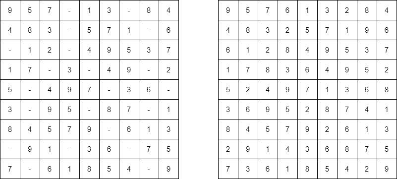

# Sudoku Solver

Given a 9x9 incomplete sudoku, solve it such that it becomes valid sudoku. Valid sudoku has the following properties.
1. All the rows should be filled with numbers(1 - 9) exactly once.
2. All the columns should be filled with numbers(1 - 9) exactly once.
3. Each 3x3 submatrix should be filled with numbers(1 - 9) exactly once.

**Note: Character '.' indicates empty cell.**

Input -> Output: 


<br>

## The Only Approach 

### Algorithm
- Traverse through the matrix and check for a empty place ('.')
- For numbers 1-9 check if you can place any of it in that location.
- If yes, recursively add the next elements until 
  - you reached end of the board (return true without removing the placed numbers) or 
  - cannot place any number on the baord in which case return false, removing the number which we last placed.
- As we only need to find one solution, we stop after our first true.


### Code 

```python
def solveSudoku(board):
    for i in range(9):
        for j in range(9):
            if board[i][j]=='.':
                for num in '123456789':
                    if isPlaceable(board,i,j,num):
                        board[i][j]=num
                        if solveSudoku(board):
                            return True
                        else : 
                            board[i][j]="."
                return False             # could not place any number
    return True                          # No empty place left in the baord

def isPlaceable(board,row,col,num):
    for k in range(9):
        # check every col
        if board[row][k]==num : return False
        if board[k][col]==num : return False
        if board[3*(row//3)+(k//3)][3*(col//3)+(k%3)]==num : return False
    return True
    
if __name__ == "__main__":
    board = [
        ["9", "5", "7", ".", "1", "3", ".", "8", "4"],
        ["4", "8", "3", ".", "5", "7", "1", ".", "6"],
        [".", "1", "2", ".", "4", "9", "5", "3", "7"],
        ["1", "7", ".", "3", ".", "4", "9", ".", "2"],
        ["5", ".", "4", "9", "7", ".", "3", "6", "."],
        ["3", ".", "9", "5", ".", "8", "7", ".", "1"],
        ["8", "4", "5", "7", "9", ".", "6", "1", "3"],
        [".", "9", "1", ".", "3", "6", ".", "7", "5"],
        ["7", ".", "6", "1", "8", "5", "4", ".", "9"],
    ]
    solveSudoku(board)
    for i in range(9):
        for j in range(9):
            print(board[i][j], end=" ")
        print()
```
- Time complexity : O(9<sup>n<sup>2</sup></sup>)
  - in the extreme worse case in a n<sup>2</sup> board we would have 9 possible numbers
- Space complexity : O(1)
  - Cause we didn't use any extra space.