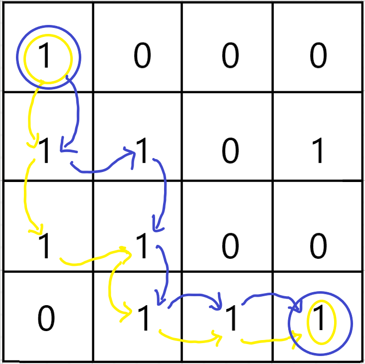
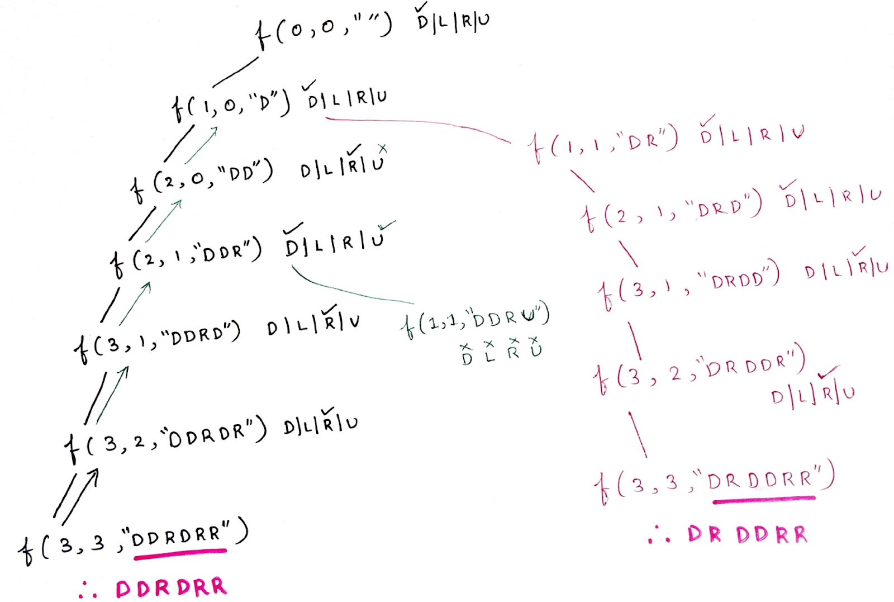
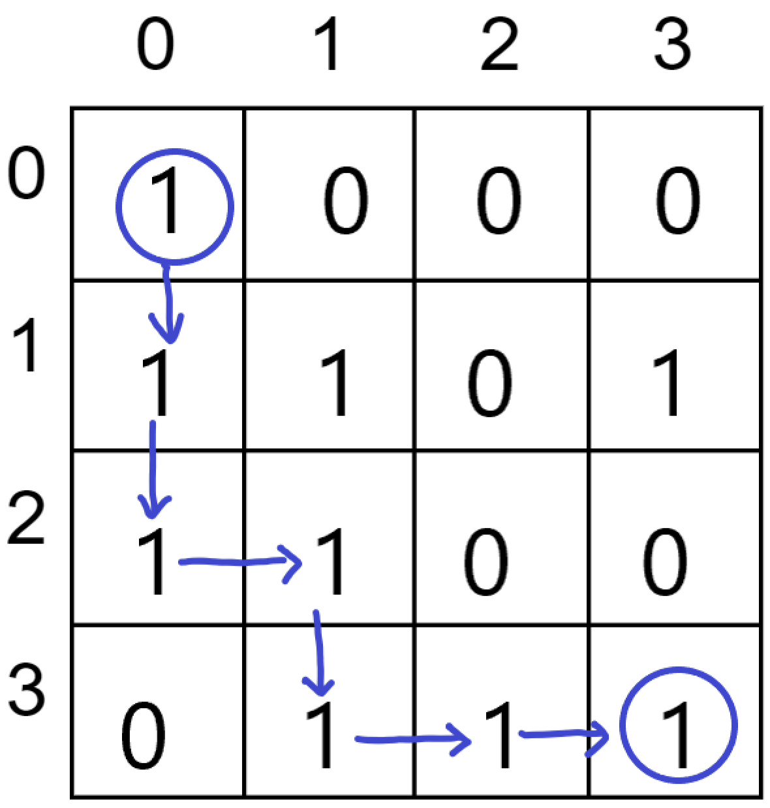
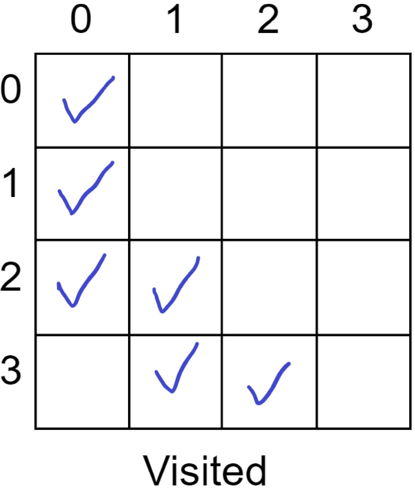
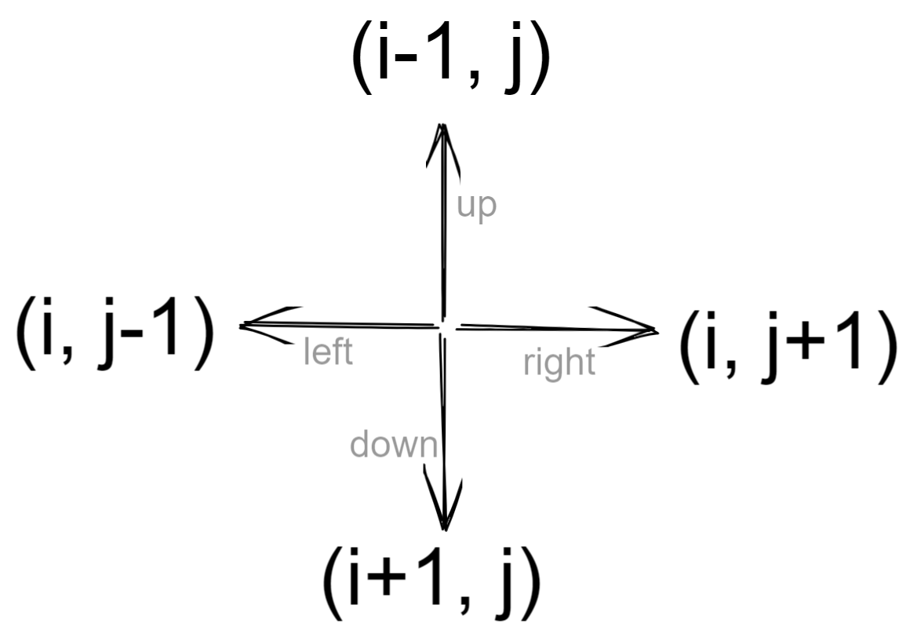
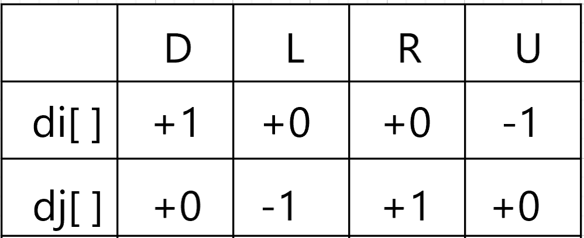

# Rat in a Maze 

- Consider a rat placed at (0, 0) in a square matrix of order N * N. It has to reach the destination at (N - 1, N - 1). Find all possible paths that the rat can take to reach from source to destination. The directions in which the rat can move are 'U'(up), 'D'(down), 'L' (left), 'R' (right). Value 0 at a cell in the matrix represents that it is blocked and the rat cannot move to it while value 1 at a cell in the matrix represents that rat can travel through it.
- **Note:** In a path, no cell can be visited more than one time.
- Print the answer in lexicographical(sorted) order
```
Example 1:
Input:
N = 4
m[][] = {{1, 0, 0, 0},
        {1, 1, 0, 1}, 
        {1, 1, 0, 0},
        {0, 1, 1, 1}}

Output: DDRDRR DRDDRR
```
Explanation:



The rat can reach the destination at (3, 3) from (0, 0) by two paths - DRDDRR and DDRDRR, when printed in sorted order we get DDRDRR DRDDRR.

```
Example 2:
Input: N = 2
       m[][] = {{1, 0},
                {1, 0}}

Output:
No path exists and the destination cell is blocked.
```

<br>

## Brute Code (Backtracking)

### Algorithm 

- [Watch it here](https://youtu.be/bLGZhJlt4y0?si=AgKFVIpa8nOFgfqF&t=233)
- Start from [0,0] and work our wayy recursively to the destination.
- We check for which direction is possible by going in lexicographical order `(DLRU)` (That will give the answers also in sorted manner)
- We keep track of the visited cells by using an visited matrix.
- If we can take the path, then we move forward by marking it
- We also need need to check for out of bounds, 0 and if we have reached the destination or not
- Base condition for recursion would be reaching destination [n-1,n-1]. 
- While going back, we need to unmark all of the marked path cells in visited.
- Diagrams to help:



For  “DDRDRR” :





### Code 

```python
from typing import List 

class Solution:
    def findPath(self,matrix,n):
       ans = []
       stack = ""
       visited = [[0 for _ in range(4)] for _ in range(4)]
       
       if matrix[0][0]==1:
       self.solve(0,0,matrix,n,stack,visited,ans)
       return ans
    
    def solve(self,i,j,matrix,n,stack,visited,ans):
       	if i==n-1 and j==n-1:
		ans.append(stack)
		return
       
		# Downward 
		if i+1<=n and not visited[i+1][j] and matrix[i+1][j]==1:
			stack+="D"
			visited[i][j]=1
			self.solve(i+1,j,matrix,n,stack,visited,ans)
			stack=stack[:-1]
			visited[i][j]=0
            
        # Left 
        if j-1>=0 in range(0,n) and not visited[i][j-1] and matrix[i][j-1]==1:
			stack+="L"
			visited[i][j]=1
			self.solve(i,j-1,matrix,n,stack,visited,ans)
			stack=stack[:-1]
			visited[i][j]=0
        
        # Right
        if j+1<=n and not visited[i][j+1] and matrix[i][j+1]==1:
			stack+="R"
			visited[i][j]=1
			self.solve(i,j+1,matrix,n,stack,visited,ans)
			stack=stack[:-1]
			visited[i][j]=0
        
        # Upward
        if i-1>=0 and not visited[i-1][j] and matrix[i-1][j]==1:
			stack+="U"
			visited[i][j]=1
			self.solve(i-1,j,matrix,n,stack,visited,ans)
			stack=stack[:-1]
			visited[i][j]=0
            

if __name__ == '__main__':
    n = 4
    m = [[1, 0, 0, 0], 
         [1, 1, 0, 1], 
         [1, 1, 0, 0], 
         [0, 1, 1, 1]]
    result = Solution().findPath(m, n)
    if len(result) == 0:
       print(-1)
    else:
       for i in range(len(result)):
       print(result[i], end=" ")
    print()
```
- **NOTE** that instead of manually adding and removing direction of the stack, we can instead directly pass stack+dir into the function call
- This way, each recusrive function, will get a new stack and while returning, it'll have previous stack without the addition.
- Example : 
```python
# Upward
if i-1 in range(0,n) and not visited[i-1][j] and matrix[i-1][j]==1:
visited[i][j]=1
self.solve(i-1,j,matrix,n,stack,visited,ans)
visited[i][j]=0
```
- Thus reducing the footprint of the function

- **Time complexity : O(4<sup>nxm</sup>)**
  - each cell we are trying 4 direcions 
- **Space complexity : O(nxm)**
  - worse case all cells are visited so we would need a nxm visited matrix

<br>

## Optimized Code (Optimized the directions)

### Algorithm 

- [Watch it here](https://youtu.be/bLGZhJlt4y0?si=_JwZZLLLMlnOj1Zo&t=1270)
- We can combine all the 4 diffrent directional ifs by combining them under one for loop using the following logic:





- Now for each direction, we just need to add the displacement to the indexes in the loop : 

```python

class Solution:
    def findPath(self,matrix,n):
        ans = []
        stack = ""
        visited = [[0 for _ in range(n)] for _ in range(n)]
        di = [+1,0,0,-1]
        dj = [0,-1,+1,0]
        
        if matrix[0][0]==1:
            self.solve(0,0,matrix,n,stack,visited,di,dj,ans)

        return ans
    
    def solve(self,i,j,matrix,n,stack,visited,di,dj,ans):
        if i==n-1 and j==n-1:
            ans.append(stack)
            return
        
        # Combining all the four directional ifs into one
        direction = "DLRU"
        for index in range(4):
            nexti = i+di[index]
            nextj = j+dj[index]
            if nexti in range(n) and nextj in range(n) and matrix[nexti][nextj]==1 and not visited[nexti][nextj]:
                visited[i][j]=1

                # Notice how we are creating a new stack everytime we are making the next recursive function call
                self.solve(nexti,nextj,matrix,n,stack+direction[index],visited,di,dj,ans)
                # That also frees us from removing the added direction after the recursive function call
                
                visited[i][j]=0

        

if __name__ == "__main__":
    n = 4
    m = [[1, 0, 0, 0], [1, 1, 0, 1], [1, 1, 0, 0], [0, 1, 1, 1]]
    obj = Solution()
    result = obj.findPath(m, n)
    if len(result) == 0:
        print(-1)
    else:
        for i in range(len(result)):
            print(result[i], end=" ")   # DDRDRR DRDDRR
    print()
```
- **Time complexity : O(4<sup>nxm</sup>)**
  - each cell we are trying 4 direcions 
- **Space complexity : O(nxm)**
  - worse case all cells are visited so we would need a nxm visited matrix
